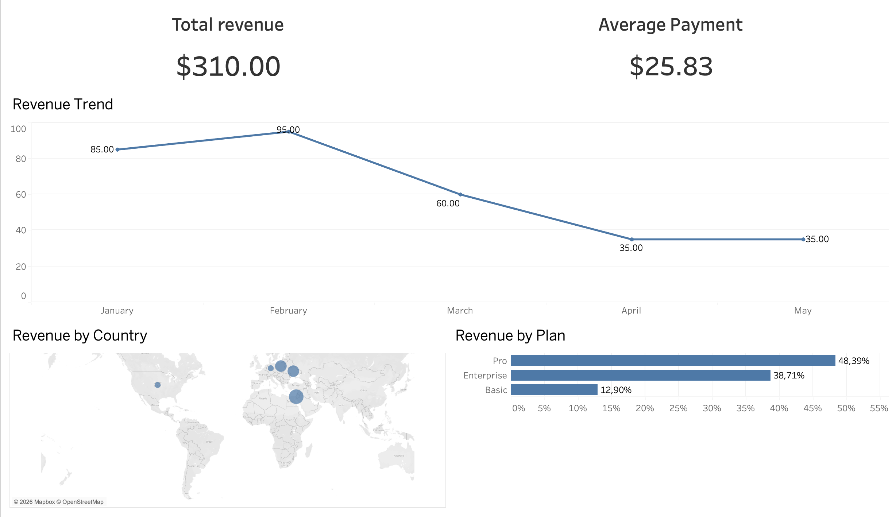

# Revenue Analytics SQL Project

This project demonstrates building a simple revenue analytics model using PostgreSQL.

The dataset simulates a subscription-based SaaS business with customers, subscription plans, and payments.

The project includes:

- Star schema data model
- SQL queries for revenue analysis
- Dashboard visualization in Tableau

---

# Data Model

The warehouse follows a **star schema** design.

Fact tables:

- fact_payments
- fact_subscriptions

Dimension tables:

- dim_customers
- dim_plans

Relationship structure:

Customers → Subscriptions → Payments  
                     ↑  
                    Plans

---

# Example SQL Analysis

### Total Revenue

```sql
SELECT SUM(amount) AS total_revenue
FROM fact_payments;
```

### Revenue by Country

```sql
SELECT 
    c.country,
    SUM(f.amount) AS revenue
FROM fact_payments f
JOIN fact_subscriptions s
    ON f.subscription_id = s.subscription_id
JOIN dim_customers c
    ON s.customer_id = c.customer_id
GROUP BY c.country
ORDER BY revenue DESC;
```

### Revenue by Plan

```sql
SELECT
    p.plan_name,
    SUM(f.amount) AS revenue
FROM fact_payments f
JOIN fact_subscriptions s
    ON f.subscription_id = s.subscription_id
JOIN dim_plans p
    ON s.plan_id = p.plan_id
GROUP BY p.plan_name
ORDER BY revenue DESC;
```

---

# Dashboard


The dataset was visualized using Tableau.

The dashboard includes:

- Total Revenue KPI
- Average Payment KPI
- Revenue Trend by Month
- Revenue by Country
- Revenue by Plan

---

# Skills Demonstrated

This project demonstrates practical SQL skills including:

- SQL joins
- Aggregations
- Data modeling
- Star schema design
- Revenue analytics queries
- Basic BI dashboard creation